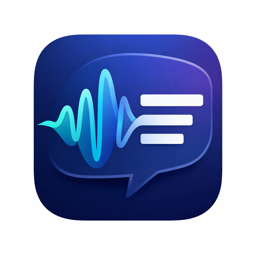

<p align="center">
  
</p>

<h1 align="center">Bolo</h1>

<p align="center">
  <em>बोलो — Hindi for "speak"</em><br>
  Voice-to-text for macOS, powered by Google Gemini
</p>

<p align="center">
  
  
  
</p>

---

Bolo is a native macOS menu bar app that turns your voice into polished, ready-to-use text in any application. Hold a key, speak naturally, release — your words appear at the cursor, cleaned up with proper punctuation, grammar, and no filler words.

## How It Works

| Mode | Trigger | What It Does |
|------|---------|-------------|
| **Push-to-Talk** | Hold `Ctrl+Shift` | Dictate a sentence or two — text appears when you release |
| **Long-Talk** | `Ctrl+Shift+Space` | Longer dictation for emails, notes, brain dumps |
| **Command** | Select text + hold `Ctrl+Shift` | Speak a command like "make this formal" or "fix the grammar" |

Bolo works in every app — Mail, Slack, VS Code, Notion, Google Docs, iMessage, and anywhere else you can type.

## Screenshots

<!-- TODO: Add screenshots -->
<!-- Uncomment and update paths when screenshots are ready:
<p align="center">
  
  
</p>
<p align="center">
  
  
</p>
-->

> *Screenshots coming soon — menu bar, recording indicator, settings, history, and command mode.*

## Features

- **Intelligent transcription** — removes filler words ("um", "uh", "like"), adds punctuation, fixes grammar
- **Context-aware** — reads surrounding text to match tone and formatting
- **Course correction** — say "no wait" or "actually" and Bolo keeps only what you meant
- **Personal dictionary** — teach Bolo your names, jargon, and acronyms
- **Command mode** — select text and speak a transformation ("summarize this", "translate to Spanish")
- **Word counter** — track your daily and all-time transcription stats
- **Transcription history** — searchable log of everything you've dictated
- **Privacy-first** — audio is never stored; everything stays on your device

## Installation

### Download

Grab the latest `.dmg` from the [Releases](https://github.com/sskokku/Bolo/releases) page, open it, and drag Bolo to your Applications folder.

### Build from Source

Bolo uses [XcodeGen](https://github.com/yonaskolb/XcodeGen) to generate its Xcode project.

```bash
# Clone the repo
git clone https://github.com/sskokku/Bolo.git
cd Bolo

# Generate the Xcode project
xcodegen generate

# Open in Xcode
open Bolo.xcodeproj
```

Build and run with `Cmd+R`. Requires Xcode 16+ and macOS 15.0 (Sequoia).

## Setup

On first launch, Bolo walks you through:

1. **Microphone access** — needed to capture your voice
2. **Accessibility access** — needed to insert text and detect hotkeys
3. **API configuration** — choose one:

| Method | Best For | Setup |
|--------|----------|-------|
| **Gemini API Key** | Personal use | Free key from [aistudio.google.com](https://aistudio.google.com/app/apikey) |
| **Vertex AI (Google Sign-In)** | Company/enterprise use | OAuth2 with your Google Workspace account — per-user identity attribution for usage tracking |

Both methods use the same Gemini model. Only one is active at a time.

## Architecture

```
Bolo/
├── Core/               # Business logic
│   ├── GeminiClient        # Gemini API (direct API key auth)
│   ├── VertexAIClient      # Vertex AI (OAuth2 Bearer token auth)
│   ├── OAuthTokenManager   # Token lifecycle, Keychain storage, auto-refresh
│   ├── OAuthSignInHandler  # OAuth2 Authorization Code flow with PKCE
│   ├── HistoryManager      # SQLite-backed transcription history
│   └── DictionaryManager   # Personal dictionary with usage tracking
├── Platform/macOS/     # macOS-specific integrations
│   ├── MenuBarController   # NSStatusItem menu bar icon and dropdown
│   ├── FloatingToolbar     # Floating recording indicator pill
│   ├── MacOSHotkeyManager  # CGEvent tap / NSEvent global hotkeys
│   ├── MacOSAudioCapture   # AVAudioEngine recording to WAV
│   └── MacOSTextInsertion  # AX-based text insertion and context reading
├── Views/              # SwiftUI views
│   ├── SettingsView        # API config, hotkey prefs, indicator style
│   ├── DictionaryView      # Manage personal dictionary
│   ├── HistoryView         # Searchable transcription history with stats
│   └── OnboardingView      # First-launch setup wizard
└── Models/             # Data types
```

Key design decisions:
- **Swift 6 strict concurrency** — `Sendable`, `@MainActor`, no data races
- **`TranscriptionProvider` protocol** — runtime switching between Gemini Direct and Vertex AI
- **Menu bar app** (`LSUIElement`) — no Dock icon, no app menu; managed entirely from the status bar
- **OAuth2 PKCE for desktop** — loopback HTTP server via `Network.framework`, no client secret needed

## Requirements

- macOS 15.0 (Sequoia) or later
- Microphone
- Internet connection
- Gemini API key (free) or Google Workspace account with Vertex AI access

## Privacy

Bolo does not collect analytics, crash reports, or personal information. Voice audio is sent to Google's Gemini API for processing and immediately discarded — it is never stored locally or remotely by Bolo. Your API key and OAuth tokens are stored in the macOS Keychain. See [PRIVACY.md](PRIVACY.md) for full details.

## License

[MIT](LICENSE)

---

<p align="center">
  <sub>Built with SwiftUI, AVAudioEngine, and Google Gemini.</sub>
</p>
